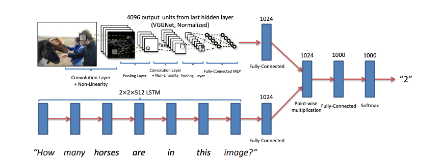
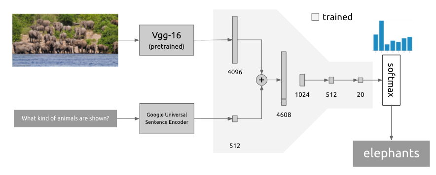
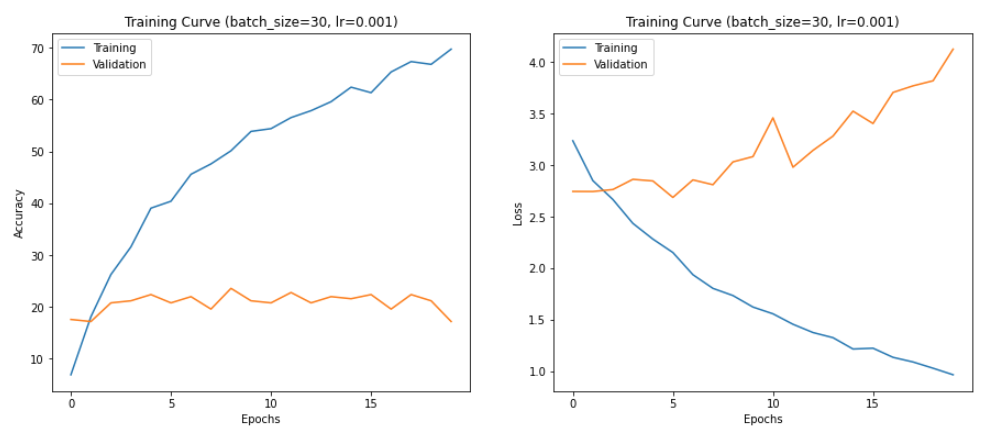
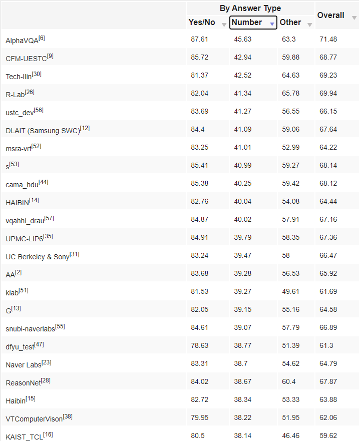
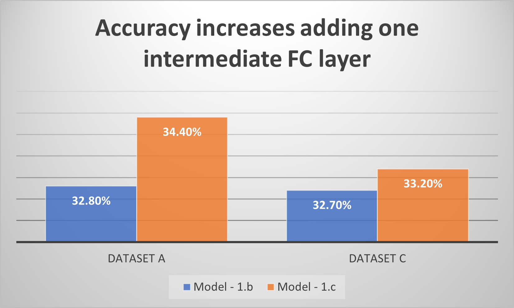
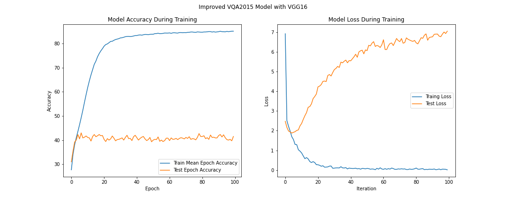

# Visual Question Answering

Final Project for the UPC [Artificial Intelligence with Deep Learning Postgraduate Course](https://www.talent.upc.edu/cat/estudis/formacio/curs/310401/postgrau-artificial-intelligence-deep-learning/) 2020.

* Authors: Rafael Garcia, Bernat Joseph, Pau Gil, Jordi Suñer
* Team Advisor: Issey Masuda
* Date: November 2020

## Table of Contents 

1. [Introduction](#intro)
    1. [Motivation](#motivation)
    2. [Milestones](#milestones)
2. [Working Environment](#working_env)
3. [Data Sets](#datasets)
4. [General Architecture](#architecture)
5. [Preliminary Tests](#preliminary)
    1. [Initial models](#initial)
    2. [Model baseline with ResNet](#visionbaseline)
    3. [Is the model actually learning something?](#learning)
    4. [How important is to train only classifier vs train also vision?](#important)
    5. [Classifier Architecture](#classifier)
    6. [Training results visualization](#resultsvisualization)    
6. [Splitting the model](#splitting)
7. [Final Tests](#final)
    1. [Baseline Model on the 100k Dataset](#guse)
    2. [Training the Question Channel](#question)
        1. [Word Embedding + LSTM](#lstm)
        2. [GloVe LSTM](#glove)
     3. [Results Summary](#resultssummary)
8. [Result analysis](#results)
    1. [Accuracies by question type (*best accuracies excluding yes/no questions*)](#best)
    2. [Accuracies by question type (*worst accuracies excluding yes/no questions*)](#worst)
    3. [Interesting data](#interestingdata)
    4. [Interesting samples](#interestingsamples)
9. [Conclusions and Lessons Learned](#conclusions)
10. [Next steps](#next_steps)
11. [References](#references)

# Introduction 
Visual Question Answering (VQA) it's aiming to answer Free-form and open-ended Question about an Image, using Computer Vision & Language Processing

## Motivation 
We have decided this project because we considered that being able to answer a question from an image using AI it's 'cool' and, more importantly, it is a project that due to the multimodal approach requires that you must understand two of the most important disciplines in AI-DL: vision and language processing.

In addition it's an area relatively new.  (2014 - Papers 2015) with plenty of opportunities for improvement and several possible business applications: 
* Image retrieval - Product search in digital catalogs (e.g: Amazon)
* Human-computer interaction (e.g.: Ask to a camera the weather)
* Intelligence Analysis
* support visually impaired individuals

<a href="#toc">To top</a>

## Milestones 
- Build a base model
- Discuss possible model improvements
- Tune/Improve base model
- Final model

<a href="#toc">To top</a>

# Working environment 
One of our earliests decissions was to discard Tensor Flow in favour of **Pytorch**. We have had very few labs with Tensor Flow at that time and the learning curve for Pytorch seemed less steep.
**Google Colab** became quickly our preferred environment due to its easy of use, allowing us to combine text,code and graphics in a single document. The possibility of using GPUs became quickly a must as the size of the datasets got bigger.
In order to get shared access to our datasets, we stored them in a shared **Google Drive** folder wich could be conveniently connected to Google Colab backend using the `google.colab` module. After working this way for a while, we discovered that using OS access Colab possibilities (`!command`) to copy the dataset to the Colab's machine local disk was better in terms of performance.

   

<a href="#toc">To top</a>

# Data Sets 
During the project several datasets for the different experiments were creted. Out of the ~100K images of the test dataset of the VQA 2015 paper the following datasets were created:
| Name 	| # image-question-answer triplets 	| Answer Type 	|
|:-:	|:--------------------------------:	|:-----------:	|
| A 	|               0.1k                |  Number 1-20 	|
| B 	|                1k                	|  Number 1-20 	|
| C 	|                5k               	|  Number 1-20 	|
| D 	|                10k               	|  Number 1-20 	|
| E 	|                10k               	|    Yes/No   	|

Finally, after preliminary tests were performed a final dataset was created by passing 100k images thrugh the corresponding image networks (VGG16 and ResNet50) to obtain Pytorch tensor datasets that allow for faster training on a such a big dataset:

| Name  | # image tensor-question-answer triplets 	| Answer Type 	|
|:-:	|:--------------------------------:	|:-----------:	|
| 100k 	|                100k               |    Open      	|

Details on the procedure can be found in section [Splitting the model](#splitting).

<a href="#toc">To top</a>

# General Architecture 
Our models are based on the best performing one from paper [VQA: Visual Question Answering](https://arxiv.org/pdf/1505.00468.pdf):

The model had two branches: one for vision (image) and one for language (question). For the language branch, several alternatives were mentioned, all of them involved training the question embeddings. At least two different ways of combining the information from both channels were also tested.
With all this variants, a more general approach to the model can be seen as a framework with interchangeable pieces.

Our proposal is to use the paper model as a base and introduce variations in the composing elements:

- Using a different (newer) model for vision
- Using a different strategy for the language channel
- Using different embedding combination operations
- Other variations (ie. replace tanh by relu as non linearity)

Implement base and tuned models and check their metrics
Choose a final model and analyze its results

<a href="#toc">To top</a>

# Preliminary Tests 
## Initial models 
The best performing model from the paper used a pretrained  **vgg-16** for the vision piece and a 2 layer LSTM for the language channel. As we haven't gone through the NLP part of course at that time and, in order to have a complete working model as soon as possible, we decided to keep the original vision piece but go for pretrained embeddings for the whole question. Looking for a suitable model and after discarding the word oriented alternatives (Glove, Word2Vec), we found Google's [Universal Sentence Encoder](https://static.googleusercontent.com/media/research.google.com/ca//pubs/archive/46808.pdf). It provides 512 dim encodings for a sentence(question) and there is a Tensor Flow based [implementation](https://tfhub.dev/google/universal-sentence-encoder/4). After checking it worked fine from Google Colab and it did not collide with the rest of our Pytorch code, we used it to build our first model:

As the embeddings where of different lengths we decided to use concatenation to combine them (4096+512=4608). The final classifier was a funnel of three fully connected layers (4608-1024-512-20).

To train this initial model, and due to computing resource limitations, we created a custom dataset. It was a very reduced version of the original COCO dataset. It was actually a random selection of 1000 triplets (image, question, annotation) including only answers of type `'number'`and values from 1 to 20 extracted from the [2014 validation dataset](https://visualqa.org/download.html).
With this first dataset we wanted to have a fixed number of outputs at the classifier (20) and a manageable dataset size. We used 750 samples for training and 250 for validation. We developed a specific `Dataset`object to combine image, question text and annotation extracted from the COCO dataset files.

We managed to train the model but showed signs of overfit:

We tried to improve the metrics by adding `dropout` layers between the fully connected layers of the classifier and batch normalization but 
the accuracy peaked around 25% and didn´t get better, even if the model was trained for more epochs.
A quick analysis of the dataset showed it was highly inbalanced, with answers 1, 2 and 3 outnumbering the others alltogether. We used a weighted loss using #annotations/freq(annotation) to see what was the impact on the accuracy. The result was: more classes participated in the accuracy but the overall accuracy didn't improve.

A new dataset of 7500 samples (+ 250 for validation) with same selection as before (answers 1-20). Accuracy raised to 35%. Below expectations considering the task had been simplificated.

Using a similar dataset but including only yes/no answer type:

Accuracy peaked close to 65% which is also belo expectations as it is only 15 points over random answer.

| Metric | Value |
| ----------- | ----------- |
| Throughput | 24.8 samples/s |
| Epochs | 20 |
| Accuracy (train) | 24.8% |
| Accuracy (validation) | 79.8% |

This model's code can be found [here](model-colabs/Model100.ipynb).

<a href="#toc">To top</a>

## Model baseline with Resnet 

As part of the intial research on the Vision channel we started considering the alternatives that we could have to VGG:

from all the alternatives we selected to focus on RESNET as it is one of the most common networks used today and with less computation efforts delivers better accuracy than VGGs

As part of this evaluation we wanted to check also the relevance or not of the size of the RESNET output as we were having the intuition that larger output should imply more features/resolution to help the rest of the network to deliver better accuracy.
Additionally based on previous results we were also getting the intuition that the network was not delivering better accuracy as the Dataset was too small and for this reason we created a new larger dataset

So the experiment was looking to understand:
1. What is the baseline performance for the model when RESNET it's being used? 
2. Does it matter the output resolution of vision channel?
3. Increasing the Dataset would the network perform better and leverage more powerful architectures?

Based on this we have selected the following: 
- resnet-18 (embedding size: 512)
- resnet-50 (embedding size: 2048)

|RESNET| Output Features |
|------|----------------
|RESNET18|512|
|RESNET50|2048|

Experiment Results:

| Model Name | Model Architecture | Dataset A | Dataset C | Dataset D |
|---- |--- |:----:|:----:|:----:|
|1.e | RESNET18 (512), concat 1024, 1024->4096->1024->n Classes Batchnorm, dropout|34%|33.4%|34%|
|1.f | RESNET50 (2048), concat 2560, 2560->4096->1024->n Classes Batchnorm, dropout|33.6%|33.68|36.4%|

Looking at the results obtained and the ones that we had when using first models based on VGG we got the intuition that the model that was using RESNET was getting better accuracy speacilly when the dataset was bigger however at this point of the research we coudln't yet confirm it as the models were having other differences. This is going to become a new hypothesis to be validated with additional tests.

<a href="#toc">To top</a>

## Is the model actually learning something? 
At some point of the research we were having doubts about if the model was actually learning as much as it could learn although the losses were indicating that it was learning. The main reason for this concern it's also because in just a few epoch the model stopped increasing accuracy in validation.

We came back to check what where the results of the models participating in VQA challenges. 
VQA organization is doing challenges every year and you could find the results on the 'Challenge' option of the menu and then click on 'Leaderboards'. For instace the results for 2016 are in You could find in https://visualqa.org/challenge_2016.html. We have been using these results as our model was starting from the architecture proposed on their paper from 2015.

Comparing our 36.4% with Dataset D and the results of this table and bearing in mind our hypothesis that a larger dataset would help us to increase we got the intuition that we were going in the right direction and we could accept that the model was learning properly.

In order to perform an extra validation we decided then to focus on the 'Yes/No' type of question as we were doing the assumption that creating a dataset only focusing on answering (Yes/No) will be acting as a larger dataset as we'll have on this case thousands (10K) of images but just for 2 classes.

So the new experiment consisted on creating a new 10K dataset with questions where the answer only could be "Yes/No".
For this experiment we used the model 1.f introduced before.
See below the results in a similar format than the one used for VQA organization.

|Model|Dataset 10K Number (1-20) | Dataset 10K Yes / No | Average|
|---|:---:|:---:|:---:|
|1.f|36.4%|68%|52.2%|

Based on these results we got confidence with our model and make us focus about how we could scale to train with larger datasets.

<a href="#toc">To top</a>

## How important is to train only classifier vs train also vision? 
As we were looking for options to scale the training but using the same infrastructure we decided to investigate if training also the vison channel was delivering better results. Overall the idea was that if it is not bring better results to train together classifier and vision channel then we could process the images embeddings before the training so the performance and resource consumption will be lower during training.

For this experiment we have used again our model 1.f and build the variants 1.fB and 1.fC as described below:

|Model|RESNET|
|---|---|
|1.f| Resnet50 train|
|1.fB| Resnet50 frozen|
|1.fC| Resnet50 last Convolutional train|

We perfom the evaluation of these 3 models for the datasets D & E and see below the results:

These results seem to confirm that training the vision channel with the classifier better accuracy results in validation can be achieved.

<a href="#toc">To top</a>

## Classifier Architecture 
At the initial stages of the projects we started with a simple classifier that was taking as input the information from Vision and Langugage channels and reducing it directly to the number of classes that we had to predict for that dataset.
After a few tests we got the intuition than the size of the layers and also the number of layers in addition to techniques like dropout and batchnorm could help us to increase.

For this reason we run an experiment to compare 2 models where the unique difference was the architecture of the classifier.
The objective was to compare if the accuracy of the model increases adding one intermediate level on the classifier smaller than the input size and large than the output in order to smoothly decrease from the 4096 to the output (20)

For this experiment we have used our models 1.b & 1.c and Datasets A and C

| Model Name | Model Architecture |
|---- |--- |
|1.b | RESNET18 (512), pointwise 512, 512->4096->n Classes|
|1.c | RESNET18 (512), pointwise 512, 512->4096->1024->n Classes|

As we can see this multilayer approach with progressive reduction of the number of features in the the input to the output it's increasing the accuracy of the model.

## Training results visualization 
During the project we have been evolving on the tools that we have used to visualize results.

First we have started with printing basic information
* Training Epoch-Batch-J-Image-Loss-timages-rightanswers-baccuracy-AcumAccuracy-lr
    0 299 0 7500 2.554795742034912 7500 2158.0 0.3199999928474426 0.28773333333333334 [0.003]
* *** Model Test Accuracy: 0.296

As the project was advancing we started to include plots

Finally we moved to use Tensorboard in order to use one of the most common tools for metrics visualization/analysis

<a href="#toc">To top</a>

# Splitting the model 
We realised a bigger dataset would be the best cure for our model's overfit and might bump up the metrics but the training was getting considerably long (ie. 100 minutes for 7,500 samples and 30 epochs) and after many long trainings we were sometimes banned to use Google Colab with GPU for some hours. In a Computer Vision lab we learned the trick of precalculating the image embeddings once and reuse them during the training process.
To implement it, we splitted the model in 2:

First half uses our custom dataloader but instead of feeding the model, it stores the precalculated embeddings in lists (image and question). These two lists of tensors are then stored to disk using `torch.save`. Along with these two lists, a list with the annotations, a list index-to-annotation and a dictionary with additional information about the sample are also stored.
Second half uses a `TensorDataset`to load the precalculated embeddings after retrieving the lists with `torch.load`and feeds them to the rest of the model (combination + classifier).
This change really bumped up the overall performance increasing the throughput from 50 samples/sec to 5,000 samples/sec. Additionally we've also been able to use batch sizes as big as 400 while before we were restricted to a maximum of 30. This improved performance allowed us to move from 10k to 100k datasets.

On the down size, precalculating the image embeddings prevents from finetuning the vision model (include it in the training (all or part of it,usually the final layers) so it adapts to our images.

<a href="#toc">To top</a>

# Final Tests 
In this section we focus on the results obtained with the 100k dataset. After prliminary tests, the following variations of the models have bbeen choosen for final comparison and analysis:

|      Name      	    | Image Channel 	|    Question Channel   	|
|:--------------:	    |:-------------:	|:---------------------:	|
|   VGG16 GUSE   	    |     VGG16     	|          GUSE         	|
|  ResNet50 GUSE 	    |    ResNet50   	|          GUSE         	|
|   VGG16 WE + LSTM   	|     VGG16     	| Word Embedding + LSTM 	|
|  ResNet50 WE + LSTM 	|    ResNet50   	| Word Embedding+ LSTM  	|
|   VGG16 Glove + LSTM 	|     VGG16     	|      GloVe + LSTM     	|
| ResNet50 Glove + LSTM	|    ResNet50   	|      GloVe + LSTM     	|

<a href="#toc">To top</a>

## Baseline Model on the 100k Dataset 

<a href="#toc">To top</a>

## Training the Question Channel 
### Word Embedding + LSTM 

As the course advanced we felt ready for the full implementation of one of the models from the VQA paper of 2015 including the question embedding. This embedding consists of two layers: the first one is a simle look-up table embedding for the words appearing in the training set, the second one is an LSTM layer. The final question embedding is obtained by concatenating the las hidden state and the last cell state of the LSTM output.

The goal of this implemetation was to determine wether including the question embedding as a trainable part of the network wolud result into a better accuracy. Following the same rationale of the previous experiments regarding the pre-trained image classification network two versions of this model were implemented: one based on the paper implementation with a VGG16 network for the image branch ([see Collab notebook here](model-colabs/Original_VQA2015_VGG.ipynb)), and another with a ResNet50 network for the image branch ([see Collab notebook here](model-colabs/Original_VQA2015_ResNet.ipynb)). 

A first implementation showed results similar to those obtained with the GUSE embedding used in the previous models, with test accuracies in the 35%-40% range (see the table at the end of this section for details). In this case the original paper choice for a VGG16 network results in an +5% accuracy increase with respect to the ResNet50 version. Loss curves show a clear overfitting case with the loss of the test set starting to increase after a few training epochs.

In an attempt to improve these results several improvements were applied to the original model:

- Tanh activation was removed after the word embedding
- All other Tanh activations were replaced by ReLU activations
- Hidden LSTM states were restarted at each batch
- BatchNorm added in the classifier
- Dropout removed in the classifier

The correspondig Collab notebooks of the implementation can be found [here for the VGG16 version](model-colabs/Improved_VQA2015_VGG.ipynb) and [here for the ResNet50 version](model-colabs/Improved_VQA2015_ResNet.ipynb).

After these improvements test accuracies for the VGG16 did not show any relevant improvement. However, the ResNet50 version of the implementation showed a +7% accuracy increase resulting in the best-performing model of this experiment. In both cases, it can be noticed that the improved networks are able to learn way faster, reaching accuracies in the training set around the 80% mark after only 20 epochs, while the original models did not even reach 70% after 100 epochs. The test accuracies, however are again in the same range as that of other model trained with the same dataset. Loss curves show the same behaviour as the one obtained with the original model.

The following table summarizes the results obtained in these experiments:

|                   	        | Maximum Test Accuracy 	| Maximum Mean  Train Accuracy 	|
|:-----------------:	        |:---------------------:	|:----------------------------:	|
|   Original VGG16 WE + LSTM  	|         40.60%        	|            71.90%            	|
| Original Resnet50 WE + LSTM 	|         35.10%        	|            61.87%            	|
|   Improved VGG16 WE + LSTM 	|         41.90%        	|            86.23%            	|
| Improved Resnet50 WE + LSTM 	|         42.00%        	|            85.83%            	|

The inclusion of a word embedding plus LSTM for the qustion embedding did not show relevant improvements to the overall accuracy compared to pre-trained embeddings. The similar accuracies obtained with all differnt tested architechtures suggests that no further accuracy increase can be reached using the current dataset. The imporved models that have shown a faster learning capacity would be nice candidates for a test with a larger dataset.

<a href="#toc">To top</a>

### GloVe + LSTM 
GloVe word embeddings + double layer bidirectional lstm

<a href="#toc">To top</a>

## Results Summary 

|             	        | Maximum Test Accuracy 	| Maximum Mean  Train Accuracy 	|
|:-----------------:    |:---------------------:	|:----------------------------:	|
|   VGG16 GUSE   	    |         00.00%        	|            00.00%            	|
|  ResNet50 GUSE 	    |         00.00%        	|            00.00%            	|
|   VGG16 WE + LSTM   	|         41.90%        	|            86.23%            	|
|  ResNet50 WE + LSTM 	|         42.00%        	|            85.83%            	|
|   VGG16 Glove + LSTM 	|         00.00%        	|            00.00%            	|
| ResNet50 Glove + LSTM	|         00.00%        	|            00.00%            	|

<a href="#toc">To top</a>

# Result analysis 
These results are obtained from the testing dataset (# samples) after training the xxxx model for xxx epochs with xxxx samples (training) and yyyy samples (validation)

<a href="#toc">To top</a>

## Accuracies by question type (*best accuracies excluding yes/no questions*) 

| Question type |  # questions  |  Hits  | % T1 |  Hits top 5  | % T5 |	
| --------- |  ---------:  |  ---------:  | :---------: |  ---------:  | :---------: |
| what sport is             | 121 | 101 | 83,5% | 116 | 95,9% | 
| is there a                | 522 | 431 | 82,6% | 521 | 99,8% | 
| what room is              | 100 | 81 | 81,0% | 96 | 96,0% | 
| can you                   | 97 | 67 | 69,1% | 95 | 97,9% | 
| is the woman              | 129 | 89 | 69,0% | 127 | 98,4% | 
| is there                  | 350 | 240 | 68,6% | 347 | 99,1% | 
| is the person             | 82 | 55 | 67,1% | 78 | 95,1% | 
| do                        | 182 | 122 | 67,0% | 180 | 98,9% | 
| does the                  | 357 | 238 | 66,7% | 347 | 97,2% | 
| is it                     | 410 | 268 | 65,4% | 405 | 98,8% | 
| is that a                 | 84 | 52 | 61,9% | 83 | 98,8% | 
| what animal is            | 102 | 62 | 60,8% | 80 | 78,4% | 
| is the                    | 1969 | 1185 | 60,2% | 1900 | 96,5% | 

<a href="#toc">To top</a>

## Accuracies by question type (*worst accuracies excluding yes/no questions*) 

| Question type |  # questions  |  Hits  | % T1 |  Hits top 5  | % T5 |	
| --------- |  ---------:  |  ---------:  | :---------: |  ---------:  | :---------: |
| what does the             | 226 | 41 | 18,1% | 58 | 25,7% | 
| who is                    | 135 | 23 | 17,0% | 65 | 48,1% | 
| where are the             | 137 | 23 | 16,8% | 48 | 35,0% | 
| where is the              | 452 | 73 | 16,2% | 165 | 36,5% | 
| what time                 | 186 | 30 | 16,1% | 61 | 32,8% | 
| how                       | 284 | 38 | 13,4% | 89 | 31,3% | 
| why                       | 151 | 15 | 9,9% | 35 | 23,2% | 
| why is the                | 76 | 6 | 7,9% | 12 | 15,8% | 
| what is the name          | 79 | 5 | 6,3% | 7 | 8,9% | 
| what number is            | 74 | 3 | 4,1% | 8 | 10,8% | 

<a href="#toc">To top</a>

## Interesting data 

<a href="#toc">To top</a>

## Interesting samples 

  
   

Sample on the left is a fail but a nice one: the model does not give the right answer (`butt`). The vision channel seems to have taking control and identified the whose butts are these (`elefant`). Sample on the right is a hit and also a nice one as the correct answer (`horse`) is well hidden in the background, behind the shiny Harley.

In many how-many questions, the right answer is the second most probable answer while the most probable answer given by the model is the number of individuals which can be clearly identified (not ocluded). 

-- Ocluded individuals in how-many questions
- Interpretation

<a href="#toc">To top</a>

# Conclusions and Lessons Learned 

Preliminary tests showed that out of the several decisions to be made based on the experiments, only increasing the dataset size had a real impact on the final accuracy results. These results showed that a "bigger" ResNet model could slightly imporve the accracy, as also could using deepr classifiers or training the image network. The first two options could easily be transferred to the 100k dataset provided that the image embeddings were pre-computed and the image network remained frozen. It could not have been possible to work with such a big dataset and training the full network end to end, including the image branch, with the available computational resources. Therefore, we decided to favor the option of increasing the datset size at the expense of givig up training the image branch.

Final test with the 100k databease, however, showed that the different models attained similar accuracy results. This fact suggests that such accuracies could already be the best to be obtained with the 100k dataset and that further improvement would not come from improving the models' architecture, depth or tuning, but by increasing again the dataset size.

Focusing on the lessons learned during the project besides the particular resuts obtained with each model, we would like to highlight several implementation, tuning and know-hows summayzed in the following list:

- Multimodal has helped us:
    - Consolidate knowledge around Vision
    - Consolidate knowledge around NLP
    - Learn different possibilities about how to combine the results of different networks (e.g.: pointwise, concat, Before a dot product, normalize the vectors)
- Dataset:
  - Dataset size is critical - The bigger the better
  - Class balance is very relevant
  - Performance increase based on pre-computed embeddings
- Classifier:
  - Augmentation Layer, Multilayer FC feature reduction (funnel), Dropout, Batchnorm
- Vision:
  - VGG, Resnet
- Language:
  - Google sentence encoder, Glove, Own encoders
- Train:
  - Loss, train accuracy and validation accuracy plots interpretation
  - How to combine Batch size, lr and lr schedulers
  - Transfer learning at different levels (e.g.: frozen pre-trained network, partial training or a pre-trained network, full training of a pretrained network)
  - Split the model if image embeddings are static to reduce training times and resources needed
- Visualitzation:
  - Plots, Tensoboards
- General:
  - Learn and progress by defining hypothesis, run experiments and extract conclusions and new hypothesis.

<a href="#toc">To top</a>

# Next steps 
- Use image embedding as initial context for the LSTM 
- Add attention to the language branch
- Add attention to the language branch but using the image embedding
- Enrich image information with object detection/object segmentation info
- Train Vision in addition to classifier

<a href="#toc">To top</a>

# References 
* [Understanding Learning Rate (towardsdatascience.com)](https://towardsdatascience.com/https-medium-com-dashingaditya-rakhecha-understanding-learning-rate-dd5da26bb6de)

<a href="#toc">To top</a>

